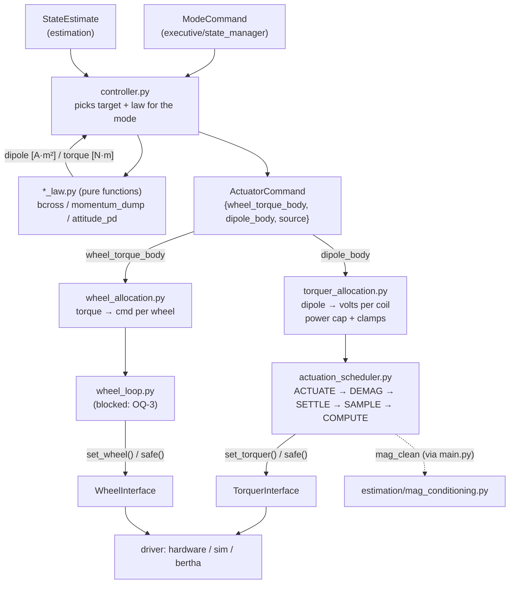

# Control pipeline

How one control tick turns a mode and a state estimate into actuator drive.
`executive/main.py` (`control_tick()`) calls each stage in order and passes
data between them; the stages don't call each other.

## Stages

1. **Controller** (`control/controller.py`): takes the `ModeCommand` and
   `StateEstimate`, picks the target and law for the mode (e.g. DETUMBLE →
   `bcross_law`, B-dot fallback if the gyro is invalid).
2. **Law** (`*_law.py`): pure function, no hardware. Returns a physical
   request in the body frame: dipole [A·m²] or torque [N·m].
3. **ActuatorCommand**: built by the controller, still in physical units.
   Unused parts are zero; `source` names the law for telemetry.
4. **Allocation**: `torquer_allocation` (dipole → volts, power cap, clamps) and
   `wheel_allocation` (torque → per-wheel command).
5. **Actuation**: `actuation_scheduler` is the only caller of
   `TorquerInterface` and applies volts only during ACTUATE, publishing
   `mag_clean` during SAMPLE. Wheels go through `wheel_loop` every tick.
6. **Device interfaces**: real, sim, or BERTHA drivers sit behind
   `TorquerInterface` / `WheelInterface`.

## Why it's layered

- Laws are arrays in, arrays out, so they're easy to unit test.
- Hardware changes touch allocation and drivers, not laws.
- Torquer timing lives in one place, so magnetometer samples stay clean.

## Not settled

Power scheduling beyond the torquer power cap (per-mode load tables, battery
checks in FDIR) is undesigned. It would live in the executive. See OQ-4 and HW
(health sensors) in `open_questions.md`.

See also `cloversat/control/README.md`.
